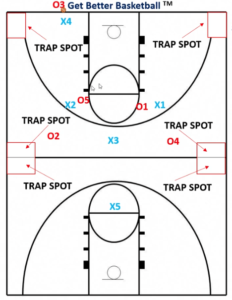

# 1 2 1 1 Defense Diamond Press

[Baylor Diamond Press Video](https://youtu.be/O__lGbz86yc?si=3vFBRIxxAdl_b4xC&t=270)

- X4 (Madman/Disruptor) needs to force pass to the side or face guarding trying to force a pass to the coffin.
- X2 covers left side
- X1 covers left side
- X4 and X2 try to trap in the top left corner (coffin)
- X4 and X3 try to trap in the top right corner (coffin)

##### If the ball is inbounded to the left:
* X4 + X2 collapse and double team
* X3 slides to middle

##### If the ball is inbounded to the right:
* X4 + X1 collapse and double team
* X3 slides to middle

X5 is taking away the long pass.
