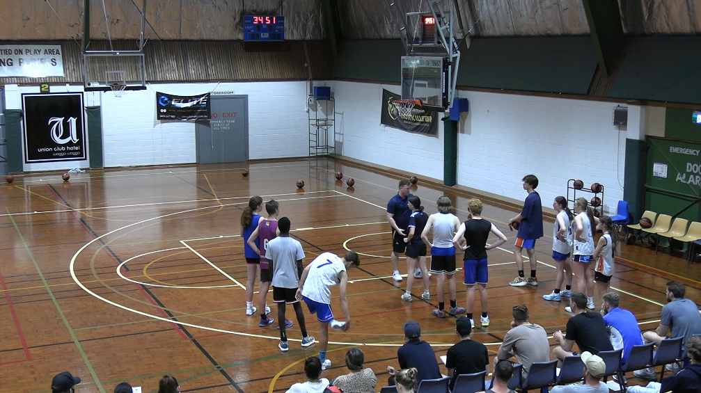
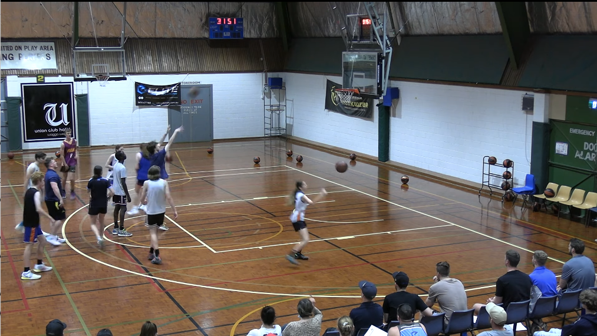

[Home](./shooting.md)

# Shooting 60s
Video: https://youtu.be/hOox5EXfWow?si=m_oIUL-f3OpaKQJJ&t=675

Position: Three lines, 3 balls. Along the side of the key out between key and 3 point line.

Time: 3 minutes on the clock

Goal: Make 20 shots from each position.

Instructions: 
- each line shoots
- the shooter retrieves their own shot and passes back to the next in line
- the shooter sprints to the other side of the court, then back to the line

- after 20 baskets, the line rotates to the top of the key
  - elbow, nail, elbow positioning
- after another 20 baskets, the line rotates to the other side of the key

Extra
- force middle line shooter to bounce pass between other player
- reenforce the fact that your ready to catch

Coaches: if they don't make the goal
- start again
- or start to zero
- do not make them do sprints, shoot more and be successful

[Home](./shooting.md)