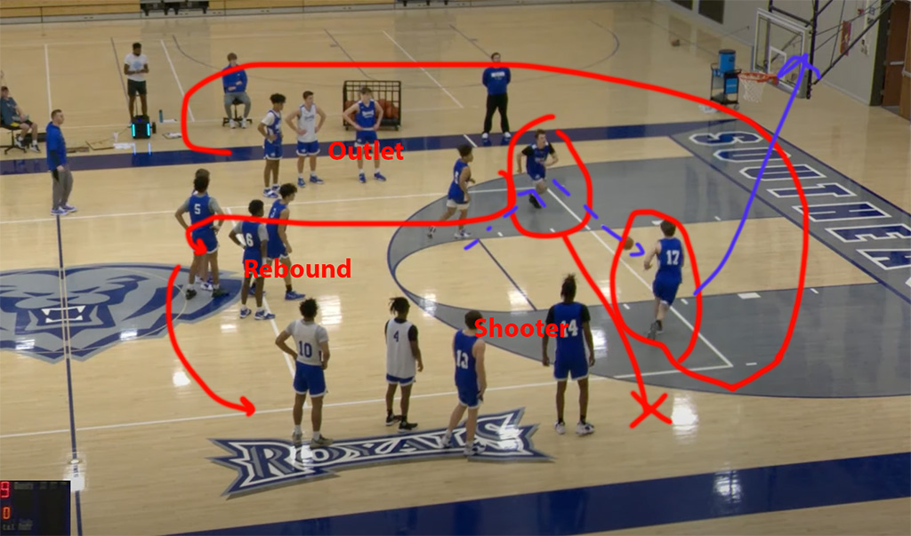

[Home](./warmup.md)

# 20-2
Video: https://youtu.be/Gsxfbk0_bsY?si=yJxswnU_-8S8G6Fi

3 Lines top of the key and 3 point line.

Instructions:
3 Lines: Outlet (top), Rebound (middle), Shooter (bottom)

1. Middle line is the rebound line passes ball to the left, outlet line.
2. Outlet line passes the ball to the cutting shooter line and cuts across to call outlet
3. Middle line (rebounder) get's the rebound if it goes it goes behind the line and passes to outlet

Everyone rotates from the top down. 
Outlet -> Rebound -> Shooter -> Outlet

Goals: 20 layups in 2 minutes

Iterations
1. Start with bounce passes
2. Next chest passes with left handed layups, pass to right line.
