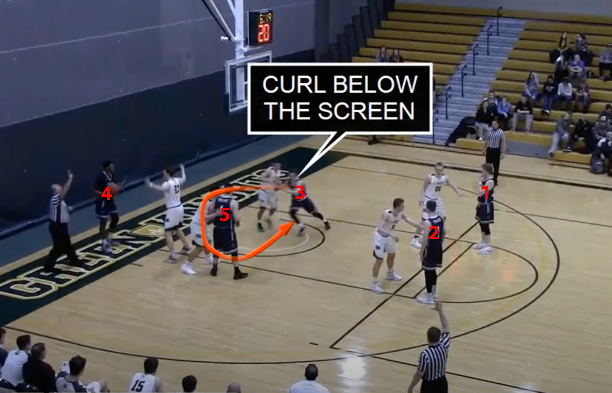
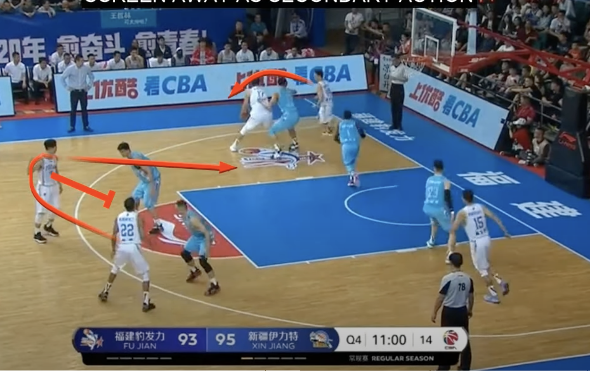
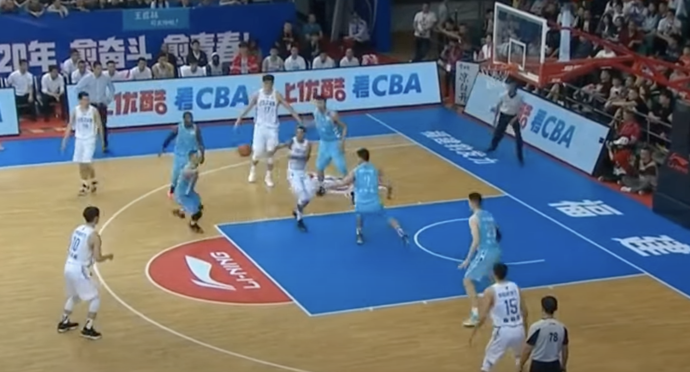
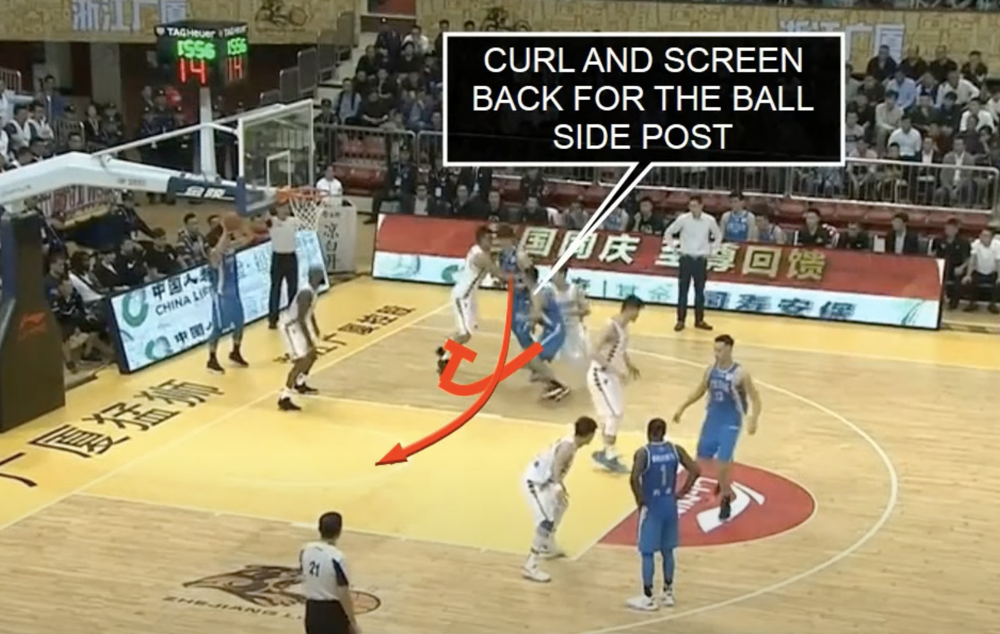

# Circle

Video: [https://youtu.be/QS6zfRVXJVY?si=PrJkQ4JYv-AdazYP&t=7](https://youtu.be/QS6zfRVXJVY?si=PrJkQ4JYv-AdazYP&t=7)

- 1 (opposite side of inbounding position) and 2 are top of key
- 3 (opposite side of inbounding position) is low block along with 5
- 4 inbounds

Instuctions:
3 cuts and uses 5 as a screen at lower block
5 steps out one step drawing big man away from 3 cutting around
3 gets inbound pass for a lay-up on right side of rim

- Meanwhile: 5 can pop action back for a pass, if 4 can't hit 3, pass to 5 and then a hand off to 4
- Meanwhile: 2 screens for 1 across key, 1 cuts to inbounder side, to look for either a pass or pop action
   - if 1 gets the ball and drives, D collapses there's a kickout to 2 who is at the 3 point line.

The pop action and kick back to 2 are possibilities during the play.

Video: [https://youtu.be/QS6zfRVXJVY?si=bLpFL6obRmWyjfpE&t=43](https://youtu.be/QS6zfRVXJVY?si=bLpFL6obRmWyjfpE&t=43)

Video: [https://youtu.be/QS6zfRVXJVY?si=NQZGAo_PtDoaI2_e&t=56](https://youtu.be/QS6zfRVXJVY?si=NQZGAo_PtDoaI2_e&t=56)

Another option off the curl screen is to come back around and screen for the 5.

