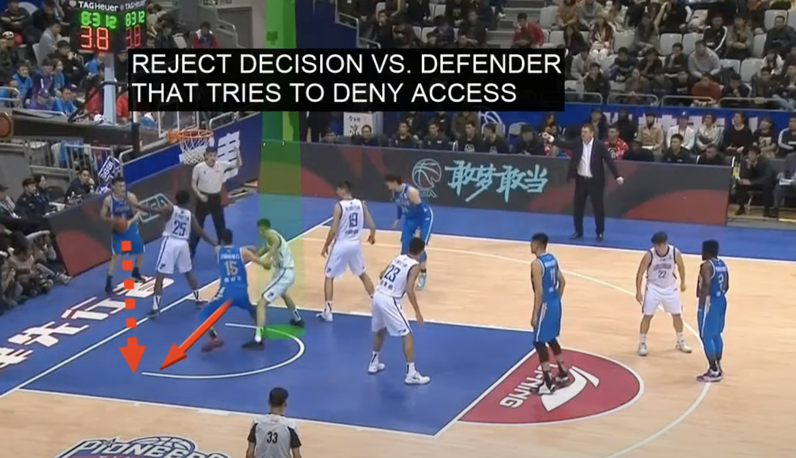

# Descisions

Video: [https://youtu.be](https://youtu.be/QS6zfRVXJVY?si=iqvY0yotZeztbEmx&t=146)

3 is positioned close to inbounder.  
5 is positioned on the block 1 meter out same side as inbounder.
1 and 2 are top setting a screen for each other

Options:
3 cuts under the hoop looking for a quick pass.
5 pops out looking for a pass.
1 and 2 screen and get open for a pass.

