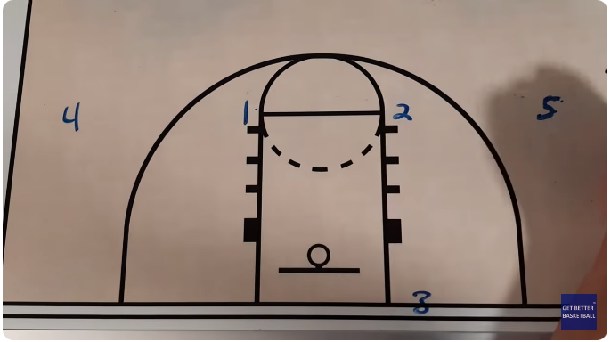

# 4 Across Press Break
[Video](https://youtu.be/1KgpwUyxUVs?si=ahPbHb6WftLiFnKe)

If we are facing a 1-2-1-1 Diamond Press, we can use a 4 across giving us the 2 extra players up front.

Setup:

- Tall player 5 on the ball side to post up.
- 2 on elbow
- 1 on elbow
- 4 week side 
- 3 inbounds

When the play starts 5 posts up, catches and squares up the floor to hit 2 cutting.  If 2 isn't open they continue down the floor, but cut across to opposite side to top of 3 point line.

Next 1 cuts through the center, and 5 tries to hit them.  

If 1 can't get the ball on a cut they cut back to the jump ball cirle. The 3 (inbounder) steps into the play to receive a reverse pass and inturn passes to 4.  4 then looks for 1 who's in the middle cutting up the floor.  As well 2 can cut back to the ball to recieve a pass from 4. 

