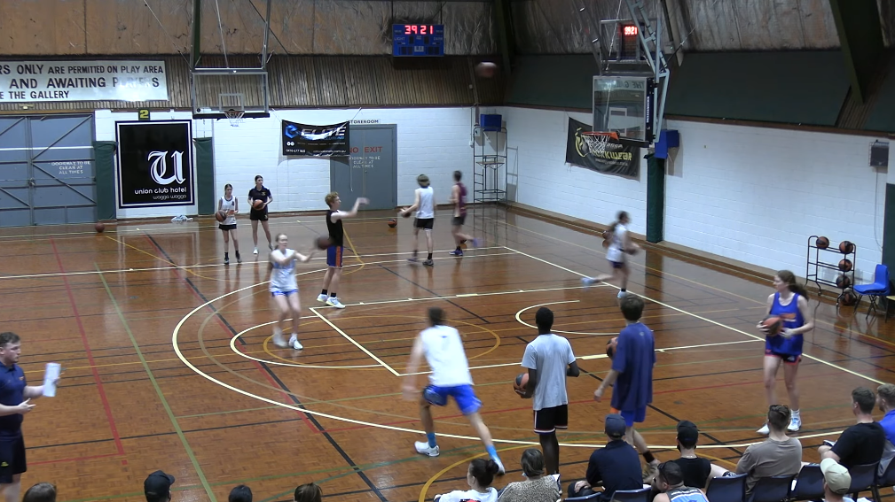
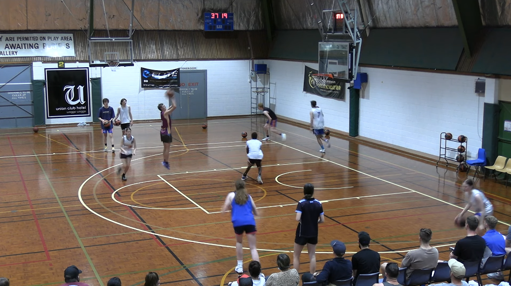

[Home](./shooting.md)

# Shooting 50s
Video: https://youtu.be/hOox5EXfWow?si=3Hd4DCKEBpwkgx4v&t=265

Everyone needs a ball, but first shooter.  Two lines starting outside 3 point line, elbow extended.

Instructions:
- first player without the ball cuts to the elbow (or near it)  
- ball is passed from opposite line to shooter
- shooter plant inside foot, catch and square up to shoot, _Where are we going to land?  In our foot prints_
- shooter  then sprints to get it and passes to next passer and sprints to end of the line

Focus: on calling for the ball, hands up and count your makes!

**Next Drill:**
https://youtu.be/hOox5EXfWow?si=l95vOIy3oQK9AmBB&t=394
Get your rebound and sprint to opposite corner, and then **quick tight dribbles** until you have to pass.

Focus on: 
* calling makes, make sure you communicate

**Next Drill**: Add a defender like a coach to force a pass around the defender.
Time: 2 minutes fast

[Home](./shooting.md)