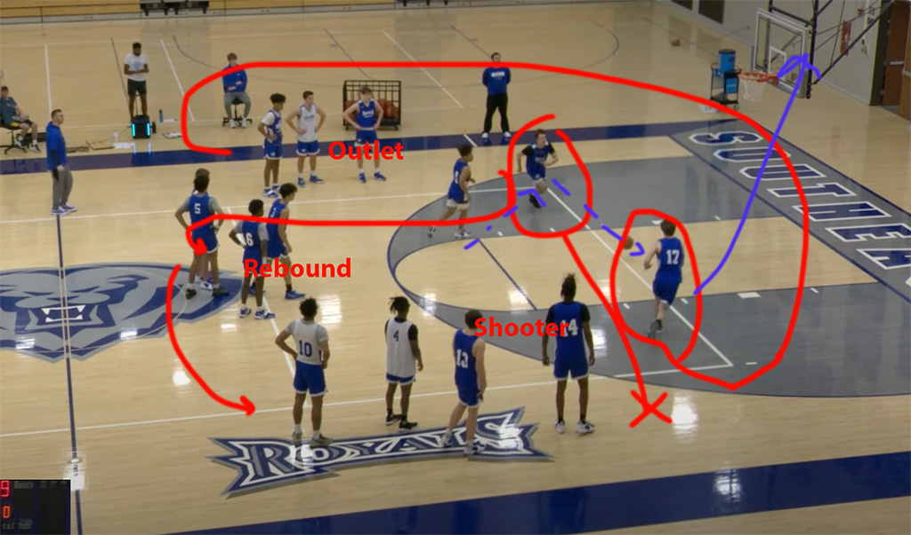

[Home](./warmup.md)

# 20-2
Video: https://youtu.be/Gsxfbk0_bsY?si=yJxswnU_-8S8G6Fi

3 Lines top of the key and 3 point line.

Goals: 20 layups in 2 minutes

Iterations
1. Start with bounce passes to the left line.
2. Next chest passes with left handed layups, pass to right line.
