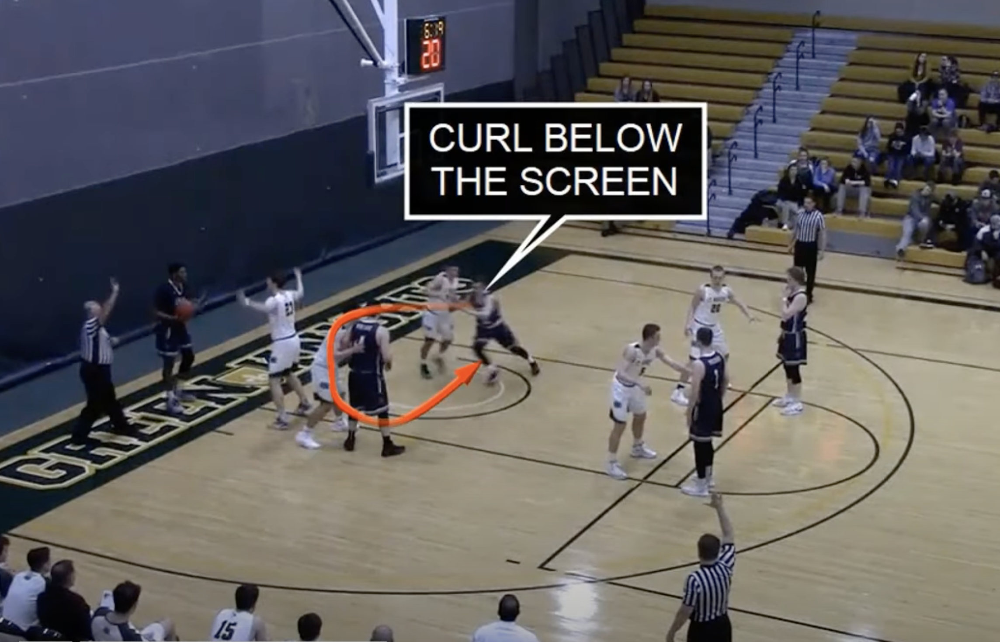
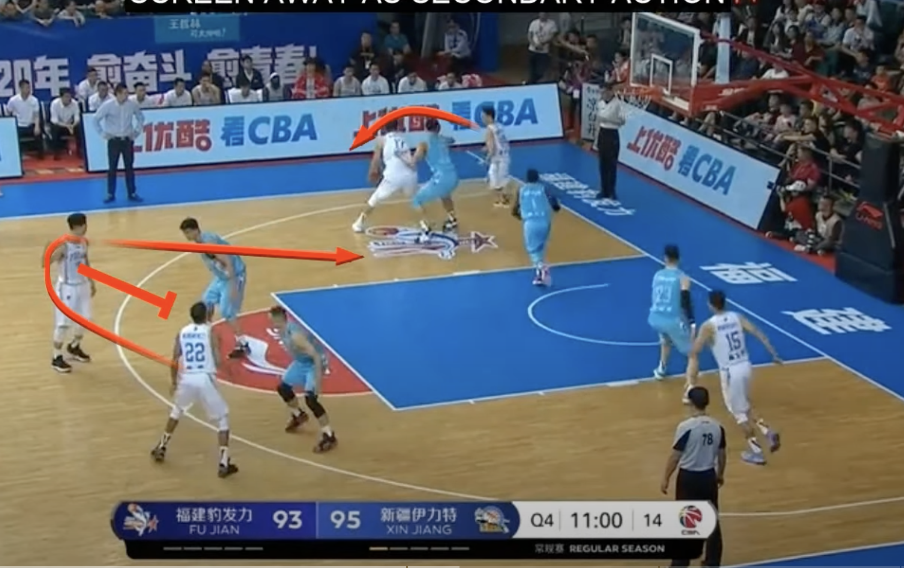
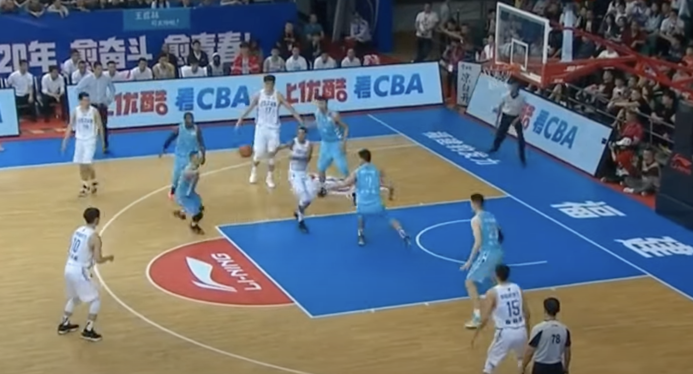
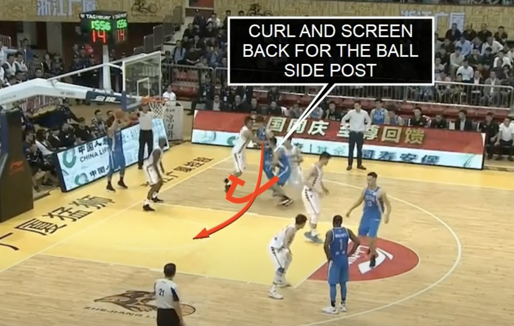

# Circle

- 1 (opposite side of inbounding position) and 2 are top of key
- 3 (opposite side of inbounding position) is low block along with 5
- 4 inbounds

Instuctions:
3 cuts and uses 5 as a screen on block
5 steps out one step drawing big man away from 3 cutting around
3 gets inbound pass for a lay-up on right side of rim

Meanwhile: 5 can pop action back for a pass, 4 does a hand off pass
Meanwhile: 2 screens for 1 across key, 1 cuts to inbounder side, to look for either a pass or pop action
   - if 1 gets the ball and drives, D collapses there's a kickout to 2 who is at the 3 point line.

Another option off the curl screen is to come back around and screen for the 5.

