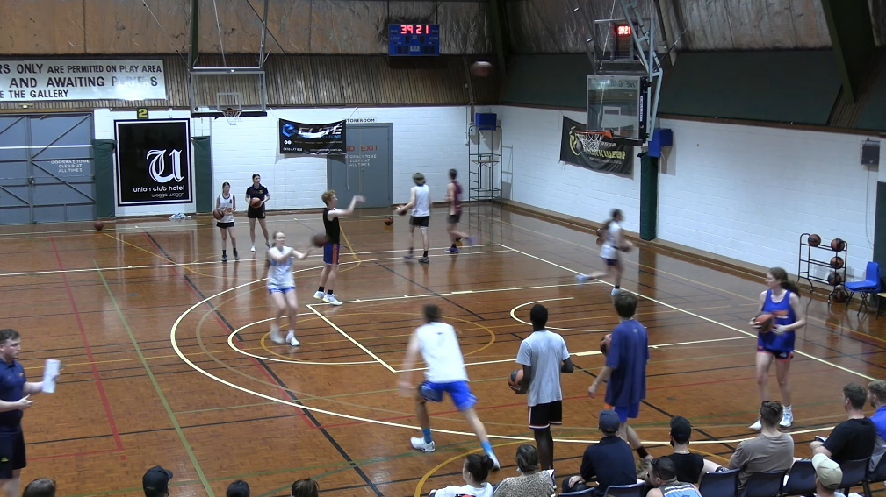
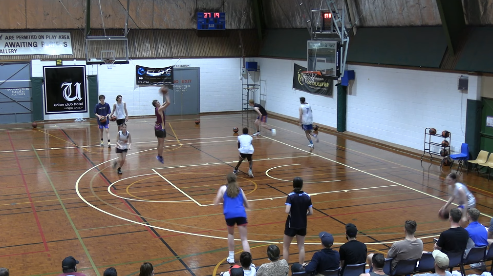

# Shooting 50s

2 lines and everyone with a ball but first shooter

- one line cuts to the elbow (or near it)
- passer opposite side passes to shooter
- shooter watches shot, sprints to get it and passes to next passer and sprints to end

Focus: on calling for the ball, hands up and count your makes!
Focus on inside foot.

Next Stage:
https://youtu.be/hOox5EXfWow?si=l95vOIy3oQK9AmBB&t=394
Get your rebound and sprint to opposite corner, and then **quick tight dribbles** until you have to pass.

Focus on: 
* calling makes, make sure you communicate

Next Stage: Add a defender like a coach to force a pass around the defender.
Time: 2 minutes fast

[Home](./shooting.md)